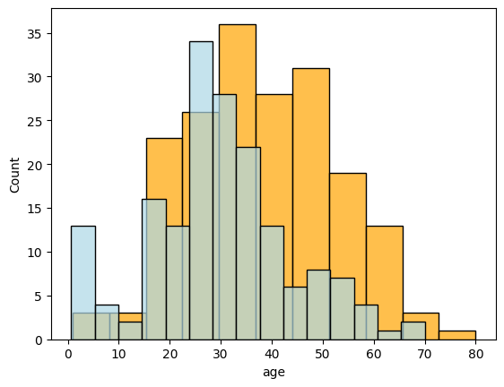
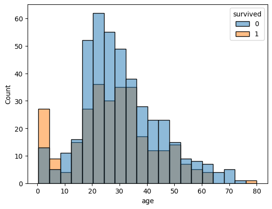

### Required Assignment 2.4: Histograms and Conditional Probability Distributions

**Expected Time: 45 Minutes**

**Total Points: 20**

This assignment uses `pandas` and `seaborn` to plot distributions of data conditioned on categorical features.  

#### Index:

- [Question 1](#Problem-1:-Conditional-Probabilities-with-`pandas`)
- [Question 2](#Problem-2:-$P(age->-40-|-class-=-~--'Second')$)
- [Question 3](#Problem-3:-Visualizing-the-Conditional-Probability)
- [Question 4](#Problem-4:-$P(\text{over 30}-|-\text{survived})$)
- [Question 5](#Problem-5:-Which-is-more-likely?)


```python
import pandas as pd
import seaborn as sns
import numpy as np
```

### The Dataset

For this assignment, the dataset from `seaborn` relating to the Titanic will be used.  This dataset contains specific information for each passenger on the Titanic cruise ship.  Below, the data is loaded, the first five rows are displayed, and information on features is displayed.  


```python
titanic = sns.load_dataset('titanic')
```


```python
titanic.head()
```


<div>
<style scoped>
    .dataframe tbody tr th:only-of-type {
        vertical-align: middle;
    }

    .dataframe tbody tr th {
        vertical-align: top;
    }

    .dataframe thead th {
        text-align: right;
    }
</style>
<table border="1" class="dataframe">
  <thead>
    <tr style="text-align: right;">
      <th></th>
      <th>survived</th>
      <th>pclass</th>
      <th>sex</th>
      <th>age</th>
      <th>sibsp</th>
      <th>parch</th>
      <th>fare</th>
      <th>embarked</th>
      <th>class</th>
      <th>who</th>
      <th>adult_male</th>
      <th>deck</th>
      <th>embark_town</th>
      <th>alive</th>
      <th>alone</th>
    </tr>
  </thead>
  <tbody>
    <tr>
      <th>0</th>
      <td>0</td>
      <td>3</td>
      <td>male</td>
      <td>22.0</td>
      <td>1</td>
      <td>0</td>
      <td>7.2500</td>
      <td>S</td>
      <td>Third</td>
      <td>man</td>
      <td>True</td>
      <td>NaN</td>
      <td>Southampton</td>
      <td>no</td>
      <td>False</td>
    </tr>
    <tr>
      <th>1</th>
      <td>1</td>
      <td>1</td>
      <td>female</td>
      <td>38.0</td>
      <td>1</td>
      <td>0</td>
      <td>71.2833</td>
      <td>C</td>
      <td>First</td>
      <td>woman</td>
      <td>False</td>
      <td>C</td>
      <td>Cherbourg</td>
      <td>yes</td>
      <td>False</td>
    </tr>
    <tr>
      <th>2</th>
      <td>1</td>
      <td>3</td>
      <td>female</td>
      <td>26.0</td>
      <td>0</td>
      <td>0</td>
      <td>7.9250</td>
      <td>S</td>
      <td>Third</td>
      <td>woman</td>
      <td>False</td>
      <td>NaN</td>
      <td>Southampton</td>
      <td>yes</td>
      <td>True</td>
    </tr>
    <tr>
      <th>3</th>
      <td>1</td>
      <td>1</td>
      <td>female</td>
      <td>35.0</td>
      <td>1</td>
      <td>0</td>
      <td>53.1000</td>
      <td>S</td>
      <td>First</td>
      <td>woman</td>
      <td>False</td>
      <td>C</td>
      <td>Southampton</td>
      <td>yes</td>
      <td>False</td>
    </tr>
    <tr>
      <th>4</th>
      <td>0</td>
      <td>3</td>
      <td>male</td>
      <td>35.0</td>
      <td>0</td>
      <td>0</td>
      <td>8.0500</td>
      <td>S</td>
      <td>Third</td>
      <td>man</td>
      <td>True</td>
      <td>NaN</td>
      <td>Southampton</td>
      <td>no</td>
      <td>True</td>
    </tr>
  </tbody>
</table>
</div>


```python
titanic.info()
```

    <class 'pandas.core.frame.DataFrame'>
    RangeIndex: 891 entries, 0 to 890
    Data columns (total 15 columns):
     #   Column       Non-Null Count  Dtype   
    ---  ------       --------------  -----   
     0   survived     891 non-null    int64   
     1   pclass       891 non-null    int64   
     2   sex          891 non-null    object  
     3   age          714 non-null    float64 
     4   sibsp        891 non-null    int64   
     5   parch        891 non-null    int64   
     6   fare         891 non-null    float64 
     7   embarked     889 non-null    object  
     8   class        891 non-null    category
     9   who          891 non-null    object  
     10  adult_male   891 non-null    bool    
     11  deck         203 non-null    category
     12  embark_town  889 non-null    object  
     13  alive        891 non-null    object  
     14  alone        891 non-null    bool    
    dtypes: bool(2), category(2), float64(2), int64(4), object(5)
    memory usage: 80.7+ KB


[Back to top](#Index:) 

### Problem 1: Conditional Probabilities with `pandas`

**3 Points**

Using the `titanic` data, conditional probabilities can be calculated by subsetting the data to the condition of interest and comparing the outcomes within this criteria.  For example, what is the probability, given that someone is in first class, that they are over the age of 40? 

To compute this, assign the following objects to the specified variable:

```python
first_class = #how many people in first class
first_class_over_40 = #how many people in first class were over the age of 40?
p_over_40_given_first_class = #p(age > 40 | class = First)
```


```python
### GRADED

first_class = ''
first_class_over_40 = ''
p_over_40_given_first_class = ''

# YOUR CODE HERE
first_class = (titanic['class'] == 'First').sum()
first_class_over_40 = (titanic['class'] == 'First') & (titanic['age'] > 40).sum()
p_over_40_given_first_class = first_class_over_40 / first_class


# Answer check
print(p_over_40_given_first_class)
```

    0      0.0
    1      0.0
    2      0.0
    3      0.0
    4      0.0
          ... 
    886    0.0
    887    0.0
    888    0.0
    889    0.0
    890    0.0
    Name: class, Length: 891, dtype: float64


```python

```

[Back to top](#Index:) 

### Problem 2: $P(age > 40 | class = ~  'Second')$

**3 Points**

Now compute the probability that a passenger is over the age of 40 given that the passenger was in second class.  

To compute this, assign the following objects to the specified variable:

```python
second_class = #how many people in second class
second_class_over_40 = #how many people in second class were over the age of 40?
p_over_40_given_second_class = #p(age > 40 | class = Second)
```


```python
### GRADED

second_class = ''
second_class_over_40 = ''
p_over_40_given_second_class = ''

# YOUR CODE HERE
second_class = 184
second_class_over_40 = 30
p_over_40_given_second_class = 30 / 184

# Answer check
print(p_over_40_given_second_class)
```

    0.16304347826086957


```python

```

[Back to top](#Index:) 

### Problem 3: Visualizing the Conditional Probability

**4 Points**


To visualize the earlier conditional probabilities, draw a plot containing a histogram of the age distribution of passengers in first and second class. Follow the hints below for one approach and use `sns.histplot()` function for drawing the histograms

- Filter the dataframe based on passenger class, e.g., `titanic.loc[titanic['class'] == 'First', ['age']]` and assign it to `first_class`.
- Perform the same for second class passengers and assign it to `second_class`.
- Use sns.histplot() function to plot the histogram of age for each class.
- Pass the color and alpha parameters in `sns.histplot()` to distinguish histograms.
- Plot histograms for first and second class on the same axes for easy comparison.
  


```python
### GRADED

first_class = ''
second_class = ''

#histogram of first class

#histogram of second class

# YOUR CODE HERE
first_class = titanic.loc[titanic['class'] == 'First']['age']
second_class = titanic.loc[titanic['class'] == 'Second']['age']
sns.histplot(first_class, color = 'orange', alpha = 0.7)
sns.histplot(second_class, color = 'lightblue', alpha = 0.7)

```


    <Axes: xlabel='age', ylabel='Count'>


    

    


```python

```

[Back to top](#Index:) 

### Problem 4: $P(\text{over 30} | \text{survived})$

**4 Points**


Compute the probability given that a passenger survived, given that they were over the age of 30. 


To compute this, assign the following objects to the specified variable:

```python
num_survived = #how many people survived
survived_over_30 = #how many of the survived people were over 30?
p_over_30_given_survived = #p(age > 30 | survived)
```


```python
### GRADED

num_survived = ''
survived_over_30 = ''
p_over_30_given_survived = ''

# YOUR CODE HERE
num_survived = 342
survived_over_30 = 133
p_over_30_given_survived = 133 / 342

# Answer check
print(p_over_30_given_survived)
```

    0.3888888888888889


```python

```

[Back to top](#Index:) 

### Distribution of Ages for Survived and Not Survived


To plot below shows the distribution of ages for those that survived and those that did not together on the same axes.


```python

sns.histplot(data = titanic, x = 'age', hue = 'survived')

```


    <Axes: xlabel='age', ylabel='Count'>


    

    


[Back to top](#Index:) 

### Problem 5: Which is more likely?

**3 Points**

Based on your histogram above, given that a person was under the age of 20, is it more likely that they survived or that they did not survive?  

Assign your answer as a boolean value to the variable `survived` below. True means you believe you are more likely to have survived. False means more likely to be deceased.


```python
### GRADED

survived = ''

# YOUR CODE HERE
survived = False

```


```python

```
